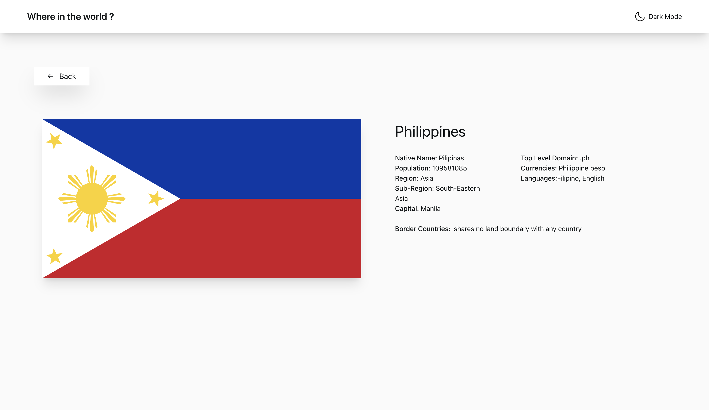

# Frontend Mentor - REST Countries API with color theme switcher solution

This is a solution to the [REST Countries API with color theme switcher challenge on Frontend Mentor](https://www.frontendmentor.io/challenges/rest-countries-api-with-color-theme-switcher-5cacc469fec04111f7b848ca). Frontend Mentor challenges help you improve your coding skills by building realistic projects.

## Table of contents

- [Overview](#overview)
  - [The challenge](#the-challenge)
  - [Screenshot](#screenshot)
  - [Links](#links)
- [My process](#my-process)
  - [Built with](#built-with)
  - [What I learned](#what-i-learned)
  - [Continued development](#continued-development)
- [Author](#author)

**Note: Delete this note and update the table of contents based on what sections you keep.**

## Overview

### The challenge

Users should be able to:

- See all countries from the API on the homepage
- Search for a country using an `input` field
- Filter countries by region
- Click on a country to see more detailed information on a separate page
- Click through to the border countries on the detail page
- Toggle the color scheme between light and dark mode _(optional)_

### Screenshot

### Links

- Solution URL: [My solution](https://www.frontendmentor.io/solutions/countries-data-using-api-djkEG2qyjk)
- Live Site URL: [Live site](https://rest-countries-omega-livid.vercel.app/)

## My process

### Built with

- Semantic HTML5 markup
- CSS custom properties
- Flexbox
- Mobile-first workflow
- [React](https://reactjs.org/) - JS library
- [React-Router-Dom](https://reactrouter.com/en/main) - JS library
- [tailwind css](https://tailwindcss.com/) - For styles

### What I learned

I am working on my reactjs skills, trying make different different UIs to increase my capability of making designs also. In this challenge i was stuck in some area but at the end i completed this task.

### Continued development

for improving this project a map can also be intergrated in the details page to see the country or cities of that country or some famous places in that country.

## Author

- Website - [Ashish Kandpal](https://my-portfolio-omega-seven-85.vercel.app/)
- Frontend Mentor - [@Ashishkandpal](https://www.frontendmentor.io/profile/Ashishkandpal)
